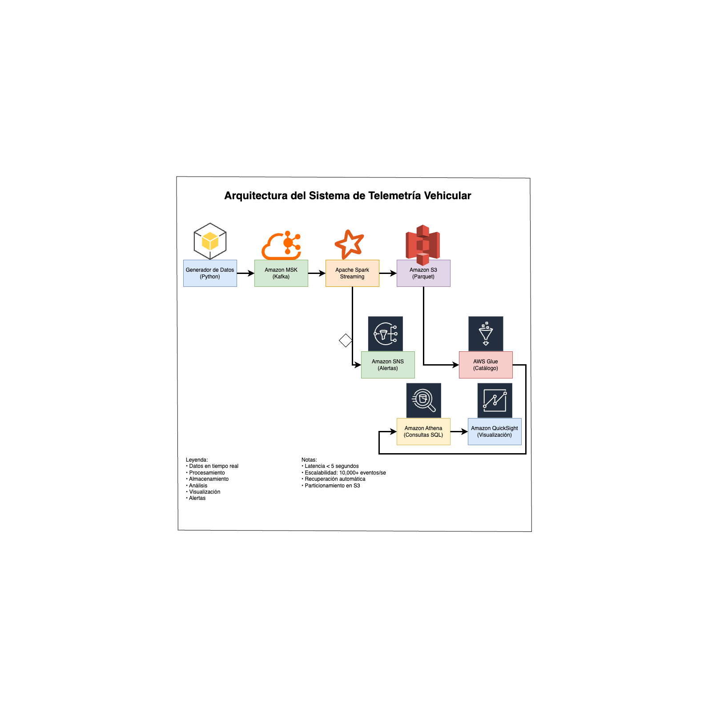

# Sistema de Telemetría Vehicular en Tiempo Real

## Descripción
Sistema de monitoreo en tiempo real para datos de sensores vehiculares, implementado con servicios AWS, Apache Spark y Scala. El sistema procesa datos de telemetría de miles de vehículos para detectar anomalías y generar alertas de mantenimiento preventivo.

## Arquitectura

### Diagrama de Arquitectura


### Componentes Principales
1. **Ingesta de Datos**
   - Amazon MSK (Kafka) para streaming de datos
   - Generador de datos de telemetría simulada
   - SSL/TLS para seguridad en tránsito

2. **Procesamiento**
   - Apache Spark Streaming con Scala
   - Procesamiento en tiempo real
   - Detección de anomalías
   - Generación de alertas

3. **Almacenamiento**
   - Amazon S3 para datos procesados
   - Formato Parquet con particionamiento
   - AWS Glue para catalogación

4. **Análisis**
   - Amazon Athena para consultas SQL
   - Amazon QuickSight para visualización
   - Amazon Kinesis Data Analytics para análisis avanzado

5. **Notificaciones**
   - Amazon SNS para alertas en tiempo real

## Requisitos Previos
- Java 11 o superior
- Scala 2.12.15
- Python 3.8+
- AWS CLI configurado
- Acceso a servicios AWS requeridos

## Configuración

### 1. Configuración de AWS
```bash
# Configurar credenciales AWS
aws configure

# Crear bucket S3
aws s3 mb s3://telemetry-bucket

# Configurar MSK
aws kafka create-cluster --cluster-name telemetry-cluster --broker-node-group-info file://broker-config.json

# Configurar Glue
aws glue create-database --database-input Name=telemetry_db
```

### 2. Configuración de Kafka
```bash
# Crear topic
kafka-topics.sh --create --topic vehicle-telemetry --bootstrap-server localhost:9092 --partitions 10 --replication-factor 3
```

### 3. Configuración de Spark
```bash
# Configurar variables de entorno
export SPARK_HOME=/path/to/spark
export AWS_ACCESS_KEY_ID=your_access_key
export AWS_SECRET_ACCESS_KEY=your_secret_key
```

## Instalación

1. Clonar el repositorio:
```bash
git clone https://github.com/your-username/telemetry-project.git
cd telemetry-project
```

2. Compilar el proyecto:
```bash
sbt clean assembly
```

3. Configurar el generador de datos:
```bash
cd scripts/test
pip install -r requirements.txt
```

## Uso

### 1. Generar Datos de Prueba
```bash
python generate_test_data.py --bootstrap-servers localhost:9092 --topic vehicle-telemetry --duration 3600
```

### 2. Ejecutar el Procesador
```bash
spark-submit --class com.vehicle.telemetry.TelemetryProcessor target/scala-2.12/telemetry-processor-assembly-1.0.jar
```

### 3. Ejecutar Consultas
```bash
# Usar la consola de Athena para ejecutar las consultas en sql/athena_queries.sql
```

## Estructura del Proyecto
```
telemetry-project/
├── spark/
│   ├── src/
│   │   ├── main/
│   │   │   └── scala/
│   │   │       └── com/
│   │   │           └── vehicle/
│   │   │               └── telemetry/
│   │   │                   ├── TelemetryProcessor.scala
│   │   │                   └── KinesisAnalytics.scala
│   │   └── test/
│   │       └── scala/
│   │           └── com/
│   │               └── vehicle/
│   │                   └── telemetry/
│   │                       ├── TelemetryProcessorTest.scala
│   │                       └── KinesisAnalyticsTest.scala
├── scripts/
│   └── test/
│       └── generate_test_data.py
├── sql/
│   └── athena_queries.sql
├── docs/
│   ├── arquitectura/
│   │   └── Diagrama_AWS_Arquitectura.png
│   └── test/
│       └── README.md
└── README.md
```

## Modelo de Datos

### Telemetría Vehicular
```json
{
    "vehicle_id": "VIN-123456789",
    "timestamp": "2025-03-25T13:45:30Z",
    "engine_temperature": 92.5,
    "vehicle_speed": 65.7,
    "fuel_level": 45.3,
    "brake_status": false,
    "location": {
        "latitude": 19.4326,
        "longitude": -99.1332
    }
}
```

### Alertas
```json
{
    "alert_id": "uuid",
    "vehicle_id": "VIN-123456789",
    "timestamp": "2025-03-25T13:45:30Z",
    "alert_type": "HIGH_TEMPERATURE",
    "alert_message": "High engine temperature: 95.5°C",
    "severity": "HIGH"
}
```

## Consideraciones de Producción

### Costos Estimados
- Amazon MSK: $0.10 por broker-hora
- Amazon S3: $0.023 por GB/mes
- Amazon Glue: $0.44 por DPU-hora
- Amazon Athena: $5 por TB escaneado
- Amazon QuickSight: $0.30 por usuario/mes
- Amazon SNS: $0.50 por millón de publicaciones

### Seguridad
- SSL/TLS para comunicación segura
- IAM roles y políticas restrictivas
- Encriptación en tránsito y en reposo
- VPC endpoints para servicios AWS

### Escalabilidad
- Particionamiento eficiente en S3
- Escalado automático de MSK
- Configuración de backpressure en Spark
- Monitoreo y alertas de recursos

## Mantenimiento

### Monitoreo
- CloudWatch para métricas
- X-Ray para trazabilidad
- Logs centralizados

### Resolución de Problemas
1. Verificar logs de Spark
2. Monitorear métricas de MSK
3. Revisar alertas de SNS
4. Analizar consultas de Athena

### Actualizaciones
1. Actualizar dependencias
2. Probar en ambiente de desarrollo
3. Desplegar en producción
4. Monitorear impacto

## Contribución
1. Fork el repositorio
2. Crear rama feature
3. Commit cambios
4. Push a la rama
5. Crear Pull Request

## Licencia
MIT License

## Análisis Avanzado con Kinesis Data Analytics

El sistema incluye análisis avanzado utilizando Amazon Kinesis Data Analytics:

1. **Análisis de Patrones de Conducción**
   - Estilo de conducción (agresivo, moderado, conservador)
   - Nivel de riesgo basado en múltiples métricas
   - Ventanas temporales de 5 minutos

2. **Detección de Anomalías**
   - Análisis estadístico en tiempo real
   - Detección de desviaciones de temperatura
   - Monitoreo de velocidad anormal
   - Ventanas temporales de 10 minutos

3. **Predicción de Mantenimiento**
   - Análisis de patrones históricos
   - Priorización de mantenimiento
   - Ventanas temporales de 24 horas 